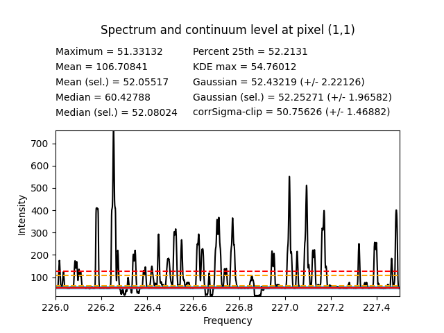
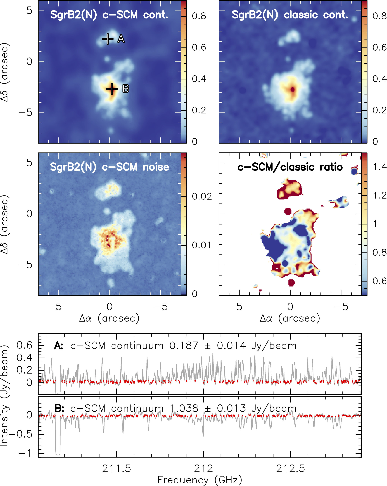
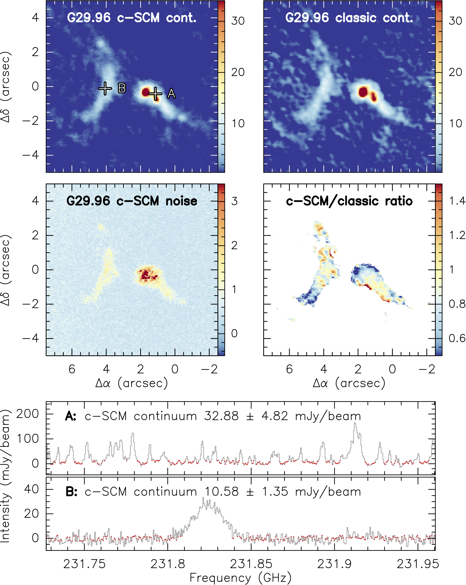

STATCONT - A statistical continuum level determination method for line-rich sources
-----------------------------------------------------------------------------------

STATCONT is a python-based tool designed to determine the continuum 
emission level in line-rich spectral data. The tool inspects the 
intensity distribution of a given spectrum and automatically determines 
the continuum level by using differeng statistical approaches. The 
different methods included in STATCONT have been tested against 
synthetic data. We conclude that the sigma-clipping algorithm provides 
the most accurate continuum level determination, together with 
information on the uncertainty in its determination. This uncertainty 
is used to correct the final continuum emission level, resulting in the 
here-called 'corrected sigma-clipping method' or cSCM. The cSCM has 
been tested against synthetic data cubes reproducing typical conditions 
found in astronomical line-rich sources. In general, we obtain 
accuracies of < 10 % in the continuum determination, and < 5 % in most 
cases. The main products of STATCONT are the continuum emission level, 
together with its uncertainty, and data cubes containing only spectral 
line emission, i.e. continuum-subtracted data cubes. STATCONT also 
includes the option to estimate the spectral index or variation of the 
continuum emission with frequency.

If you find STATCONT useful, please cite/refer to:
[Sanchez-Monge, Schilke, Ginsburg, Cesaroni and Schmiedeke 2018, A&A, 609, A101](https://ui.adsabs.harvard.edu/abs/2018A%26A...609A.101S/abstract)
Access to the article in [PDF](https://hera.ph1.uni-koeln.de/~sanchez/my_documents/publications/SanchezMonge_etal_2018.pdf) format.

More information about STATCONT can be found in [http://www.astro.uni-koeln.de/~sanchez/statcont](http://www.astro.uni-koeln.de/~sanchez/statcont)

This README document is intented to help you install and use STATCONT. In the following you will find:
  - [**Installation instructions**](https://github.com/radio-astro-tools/statcont#installation-instructions)
  - [**Required Python packages**](https://github.com/radio-astro-tools/statcont#required-python-packages)
  - [**Main STATCONT commands and options**](https://github.com/radio-astro-tools/statcont#main-statcont-commands-and-options)
  - [**Examples and test cases**](https://github.com/radio-astro-tools/statcont#examples-and-test-cases)
    - [**Determining the continuum in single spectrum files (ASCII files)**](https://github.com/radio-astro-tools/statcont/blob/master/README.md#determining-the-continuum-in-single-spectrum-files-ascii-files)
    - [**Determining the continuum in a 3D cube file (FITS files)**](https://github.com/radio-astro-tools/statcont/blob/master/README.md#determining-the-continuum-in-a-3d-cube-file-fits-files)
    - [**Determining the spectral index from multiple input files**](https://github.com/radio-astro-tools/statcont/blob/master/README.md#determining-the-spectral-index-from-multiple-input-files)
  - [**Real data examples**](https://github.com/radio-astro-tools/statcont#real-data-examples)
  - [**Publications citing STATCONT**](https://github.com/radio-astro-tools/statcont#publications-citing-statcont)

------------------------------------
Installation instructions
------------------------------------

STATCONT uses the [ASTROPY](https://www.astropy.org/) package-template and is
fully compatible with the ASTROPY ecosystem. It is freely available for download at
the [GitHub](https://github.com/) repository [Radio Astro Tools](http://radio-astro-tools.github.io/),
as well as in this [webpage](http://www.astro.uni-koeln.de/~sanchez/statcont). The only
required software to use STATCONT is Python and Astropy, together with some basic
Python packages that you can find listed [here](https://github.com/radio-astro-tools/statcont#required-python-packages).

**Installation method 1**<br />
You can clone STATCONT in your computer from the GitHub repository. For
this, create a directory and move there. Then type:

```
   git init
   git clone https://github.com/radio-astro-tools/statcont
   cd statcont
   python setup.py install
```

**Installation method 2**<br />
You can also directly install STATCONT by typing in a terminal session in 
your computer (you may need sudo permissions depending on the 
configuration of your system):

```
   pip install https://github.com/radio-astro-tools/statcont/archive/master.zip
```

**Installation method 3**<br />
Alternatively, STATCONT can also be downloaded locally as a zip file 
from: [master.zip](https://github.com/radio-astro-tools/statcont/archive/master.zip).
In order to install it, download the file to a directory in your computer:

```
   unzip master.zip
   cd statcont
   python setup.py install
```

**How to solve permission errors**<br />
If you get a permission error, this means that you do not have the required
administrative access to install STATCONT to your Python installation. In
this case you can use the option `--user` when installing the setup.py script.
You can follow these instructions:

```
   python setup.py install --user --install-scripts="~/bin/"
   export PATH=~/bin/:$PATH
```

**Check your installation**<br />
Following the installation, you have immediate access to STATCONT in 
your computer by typing "statcont" in a terminal session. For example, 
inspect the help by doing:

```
   statcont --help
```

At the beginning of the help message you will see the version of STATCONT.
The current stable release is `version 1.5`.

---------------------
Required Python packages
---------------------

STATCONT uses the following Python packages:

- [argparse](https://docs.python.org/3/library/argparse.html) : version >= 1.1
- [astropy](https://www.astropy.org/) : version >= 4.2.1
- [datetime](https://docs.python.org/3/library/datetime.html)
- [math](https://docs.python.org/3/library/math.html)
- [matplotlib](https://matplotlib.org/) : version >= 3.5.0
- [numpy](https://numpy.org/) : version >= 1.21.4
- [os](https://docs.python.org/3/library/os.html)
- [scipy](https://scipy.org/) : version >= 1.7.3

The versions indicated above have been recently tested, older versions
worked fine in previous tests and are expected to continue working.

---------------------
Main STATCONT commands and options
---------------------

The following table contains the main commands and options of STATCONT. They can be explored and executed by typing

```
   statcont --help
```


| Command | Necessary? | Description |
| --- | --- | --- |
| `--help` | | Show the help message and all the STATCONT commands |
| `-i` / `--iname` | NECESSARY<br /> (unless `-f`, `-s` or `-l` are used) | Name of the FITS file to be processed (without extension, which should be .fits)<br /> Example: `-i SYNTHETIC_cube`<br /> The file SYNTHETIC_cube.fits has to be stored in the `data` directory |
| `-f` / `--ifile` | NECESSARY<br /> (unless `-i`, `-s` or `-l` are used) | Text file containing a list of FITS files to be processed (files to be processed have to be listed without extension, which should be .fits)<br /> Example: `-f file.txt`<br /> The file file.txt has to be stored in the running directory |
| `-s` / `--ispec` | NECESSARY<br /> (unless `-i`, `-f` or `-l` are used) | Name of the ASCII file to be processed (without extension, which should be .dat)<br /> Example: `-s my_emission`<br /> The file my_emission.dat has to be stored in the `data` directory |
| `-l` / `--ilist` | NECESSARY<br /> (unless `-i`, `-f` or `-s` are used) | Text file containing a list of ASCII files to be processed (files to be processed have to be listed without extension, which should be .dat)<br /> Example: `-l file.txt`<br /> The file file.txt has to be stored in the running directory |
| `-p` / `--ipath` | OPTIONAL | Specify the path/directory there the files to be processed are stored.<br /> This path/directory has to inside the `data` directory |
| `-n` / `--noise` | NECESSARY | Typical RMS noise level of the observations<br /> A value of 1 can be used in most of the cases |
| `--continuum` | OPTIONAL | Determination of the continuum level and create of line-only cube or spectrum |
| `--plots` | OPTIONAL | Create plots on a pixel-by-pixel basis |
| `--cutout` | OPTIONAL | Create a cutout image of the original FITS cube<br /> Three parameters have to be specified (`xcen`, `ycen` and `size`) in pixels |
| `--spindex` | OPTIONAL | Determine the spectral index (ALPHA) defined as flux = FACTOR * frequency^(ALPHA) |


---------------------
Examples and test cases
---------------------

In the following we explain how to execute the main tasks of STATCONT. 
A set of test cases is provided in this [test_cases.tar.gz](https://hera.ph1.uni-koeln.de/~sanchez/software/STATCONT/test_cases.tar.gz) file. 
Download the file to your computer and follow these instructions:

```
   gunzip test_cases.tar.gz
   tar -xvf test_cases.tar
```

This creates a directory called `statcont-tests`. Inside, you will
find a directory called data that contains three other subdirectories
`MAP_TESTS`, `SPEC_TESTS`, and `SPINDEX`

STATCONT requires of a directory data where the files to be processed 
are stored. By executing STATCONT, another directory called products 
will be generated. The files to be processed, can be directly saved in 
the data directory or in subdirectories within data. In the examples
provided here, we have a set of single-spectrum files (in ASCII format)
saved in the subdirectories `SPEC_TESTS` and `SPINDEX`, and a FITS cube
in the subdirectory `MAP_TESTS`.


Determining the continuum in single spectrum files (ASCII files)
----------------------------------------------------------------

```
   statcont -p SPEC_TESTS -s my_emission -n 1
```

  - The option -p indicates the subdirectory in data that contains
    the file to be analyzed
  - The option -s indicates the name of the ASCII file to be
    analyzed, without the extension [.dat]
  - The option -n indicates the rms noise level (in the units of the
    data) of the data to be analyzed. In this case, it is 1 K

If you want to determine the continuum level:

```
   statcont -p SPEC_TESTS -s my_emission -n 1 --continuum
```

  - The option --continuum makes use of the 'corrected sigma-clipping 
    algorithm' described in [Sanchez-Monge et al (2018)](https://ui.adsabs.harvard.edu/abs/2018A%26A...609A.101S/abstract), to determine
    the continuum level, the error in the continuum level, and to
    produce a file that contains only the line emission, i.e. a
    continuum-subtracted file

Using different methods to determine the continuum level. STATCONT 
contains a set of different statistical methods that can be used by the 
user at his/her convenience. You can select all them like this:

```
   statcont -p SPEC_TESTS -s my_emission -n 1 --call
```

Or you can select individual methods like:

```
   statcont -p SPEC_TESTS -s my_emission -n 1 --cmax
   statcont -p SPEC_TESTS -s my_emission -n 1 --cmean
   statcont -p SPEC_TESTS -s my_emission -n 1 --cmedian
   statcont -p SPEC_TESTS -s my_emission -n 1 --cpercent
   statcont -p SPEC_TESTS -s my_emission -n 1 --cGaussian
   statcont -p SPEC_TESTS -s my_emission -n 1 --cKDEmax
   statcont -p SPEC_TESTS -s my_emission -n 1 --csigmaclip
```

You can call several methods at once:

```
   statcont -p SPEC_TESTS -s my_emission -n 1 --cmax --cGaussian --csigmaclip
```

The different methods are explained in [Sanchez-Monge et al (2018)](https://ui.adsabs.harvard.edu/abs/2018A%26A...609A.101S/abstract)

If you want to remove the continuum from the original spectrum, in 
order to produce a line-only data file, you can use:

```
   statcont -p SPEC_TESTS - s my_emission -n 1 --csigmaclip --cfree
```

  - The option --cfree uses the 'corrected sigma-clipping algorithm'
    to determine the continuum, and removes it from the original
    datafile.

You can use other example files, like for example:

```
   statcont -p SPEC_TESTS -s my_absorption -n 1 --continuum
```

And you can select multiple files simultaneously, as long as they are 
saved in the same subdirectory, and they are considered to have the 
same rms noise level (option -n ):

```
   statcont -p SPEC_TESTS -s my_emission my_absorption my_broad-lines -n 1 --continuum
```

The products can be found in products/SPEC_TESTS
You can produce plots of the spectrum analyzed with the continuum 
levels by using the option --plots. As an example:

```
   statcont -p SPEC_TESTS -s my_emission -n 1 --continuum --plots
```

In this case the plot is saved in products/SPEC_TESTS/plots/my_emission_1_1.png
You can use all the continuum methods and plot them all together, like:

```
   statcont -p SPEC_TESTS -s my_emission -n 1 --call --plots
```

Have a look now at the plot products/SPEC_TESTS/plots/my_emission_1_1.png (see image below)


 

Determining the continuum in a 3D cube file (FITS files)
--------------------------------------------------------

```
   statcont -p MAP_TESTS -i SYNTHETIC_cube -n 1
```

  - The option -p indicates the subdirectory in data that contains
    the file to be analyzed
  - The option -i indicates the name of the FITS file to be analyzed,
    without the extension [.fits]
  - The option -n indicates the rms noise level (in the units of the
    data) of the data to be analyzed. In this case, it is 1 K

If you want to determine the continuum level:

```
   statcont -p MAP_TESTS -i SYNTHETIC_cube -n 1 --continuum
```

This process analyzes each individual pixel, determining the continuum 
level, and then combines all the pixels to produce a continuum FITS 
image with the label "_continuum". Simultaneously, the --csigmaclip 
method provides information on the error in the determination of the 
continuum that is saved as a FITS image with the label "_noise". 
Finally, a line-only FITS datacube is also produced. All these files 
are saved in the directory products/MAP_TESTS

All the other options applicable to the single-spectrum ASCII files are 
also available for the FITS images (e.g. different continuum methods, 
creation of plots).

If your original FITS file is too large and you just want to determine 
the continuum level of a small portion you can indicate it like this:

```
   statcont -p MAP_TESTS -i SYNTHETIC_cube -n 1 --continuum --cutout 25 25 6
```

  - The --cutout option allows to select a central pixel (in this case
    25, 25) and the number of pixels in each direction of the final
    image (in this case 6). With this option, the products are saved
    with the label "_cutout"


Determining the spectral index from multiple input files
--------------------------------------------------------

If you have multiple ASCII or FITS files at different frequencies, you can use 
the option `--spindex` to determine, first, the continuum level of every 
single file, and then the spectral index, i.e. the variation of the 
continuum emission with frequency.

The spectral index (ALPHA) is defined as flux = FACTOR * frequency^(ALPHA)

```
   statcont -p SPINDEX -l list.txt -n 1 --continuum
   statcont -p SPINDEX -l list.txt -n 1 --spindex
```

The first command determines the continuum level for all the files contained in the list.txt file, while the second command determines the spectral index.

-----------------------------------
Real data examples
-----------------------------------

If you have multiple ASCII or FITS files at different frequencies, you can use 

|  |  | 
|:--:|:--:| 
| *Example case SgrB2(N) (see [Sanchez-Monge et al 2017](https://ui.adsabs.harvard.edu/abs/2017A%26A...604A...6S/abstract))* | *Example case G29.96-0.02 (see [Cesaroni et al 2017](https://ui.adsabs.harvard.edu/abs/2017A%26A...602A..59C/abstract))* |

In both examples: (Top-left) Continuum emission map as determined with STATCONT. (Top-right) Continuum emission map determined with the classical approach (search for line-free channels). (Middle-left) Noise map obtained with STATCONT. (Middle-right) Ratio of the STATCONT to classical-approach continuum maps. (Bottom panels) Continuum-subtracted spectra using STATCONT towards two selected positions A and B, shown in the top-left panel.


-----------------------------------
Publications citing STATCONT
-----------------------------------

The following is a list with more than 30 publications using STATCONT in their analysis. The publications cover topics of low and high-mass star formation, extragalactic sources and astrochemical studies.

- *Is There Any Linkage between Interstellar Aldehyde and Alcohol?*<br /> by Mondal et al. 2021, ApJ, 922, 194 ([link](https://ui.adsabs.harvard.edu/abs/2021ApJ...922..194M/abstract))

- *A cold accretion flow onto one component of a multiple protostellar system*<br /> by Murillo et al. 2021, accepted for publication in A&A ([link](https://ui.adsabs.harvard.edu/abs/2021arXiv211104039M/abstract))

- *Starburst Energy Feedback Seen Through HCO + /HOC +  Emission in NGC 253 from ALCHEMI*<br /> by Harada et al. 2021, accepted for publication in ApJ ([link](https://ui.adsabs.harvard.edu/abs/2021arXiv210906476H/abstract))

- *The GUAPOS project. II. A comprehensive study of peptide-like bond molecules*<br /> by Colzi et al. 2021, A&A, 653, A129 ([link](https://ui.adsabs.harvard.edu/abs/2021A%26A...653A.129C/abstract))

- *ALCHEMI: an ALMA Comprehensive High-resolution Extragalactic Molecular Inventory. Survey presentation and first results from the ACA array*<br /> by Martin et al. 2021, accepted for publication in A&A ([link](https://ui.adsabs.harvard.edu/abs/2021arXiv210908638M/abstract))

- *ALMA observations of doubly deuterated water: inheritance of water from the prestellar environment*<br /> by Jensen et al. 2021, A&A, 650, A172 ([link](https://ui.adsabs.harvard.edu/abs/2021A%26A...650A.172J/abstract))

- *The ionized heart of a molecular disk. ALMA observations of the hyper-compact HII region G24.78+0.08 A1*<br /> by Moscadelli et al. 2021, A&A, 650, A142 ([link](https://ui.adsabs.harvard.edu/abs/2021A%26A...650A.142M/abstract))

- *Star formation in 'the Brick': ALMA reveals an active protocluster in the Galactic centre cloud G0.253+0.016*<br /> by Walker et al. 2021, MNRAS, 503, 77 ([link](https://ui.adsabs.harvard.edu/abs/2021MNRAS.503...77W/abstract))

- *Fragmentation in the massive G31.41+0.31 protocluster*<br /> by Beltran et al. 2021, A&A, 648, A100 ([link](https://ui.adsabs.harvard.edu/abs/2021A%26A...648A.100B/abstract))

- *Digging into the Interior of Hot Cores with ALMA (DIHCA). I. Dissecting the High-mass Star-forming Core G335.579-0.292 MM1*<br /> by Olguin et al. 2021, ApJ, 909, 199 ([link](https://ui.adsabs.harvard.edu/abs/2021ApJ...909..199O/abstract))

- *The prebiotic molecular inventory of Serpens SMM1. I. An investigation of the isomers CH3NCO and HOCH2CN*<br /> by Ligterink et al. 2021, A&A, 647, A87 ([link](https://ui.adsabs.harvard.edu/abs/2021A%26A...647A..87L/abstract))

- *Subarcsecond Imaging of the Complex Organic Chemistry in Massive Star-forming Region G10.6-0.4*<br /> by Law et al. 2021, ApJ, 909, 214 ([link](https://ui.adsabs.harvard.edu/abs/2021ApJ...909..214L/abstract))

- *The GUAPOS project: G31.41+0.31 Unbiased ALMA sPectral Observational Survey. I. Isomers of C2H4O2*<br /> by Mininni et al. 2020, A&A, 644, A84 ([link](https://ui.adsabs.harvard.edu/abs/2020A%26A...644A..84M/abstract))

- *Multidirectional Mass Accretion and Collimated Outflows on Scales of 100-2000 au in Early Stages of High-mass Protostars*<br /> by Goddi et al. 2020, ApJ, 905, 25 ([link](https://ui.adsabs.harvard.edu/abs/2020ApJ...905...25G/abstract))

- *Evidence for Dense Gas Heated by the Explosion in Orion KL*<br /> by Li et al. 2020, ApJ, 901, 62 ([link](https://ui.adsabs.harvard.edu/abs/2020ApJ...901...62L/abstract))

- *Detection of hydroxyacetone in protostar IRAS 16293-2422 B*<br /> by Zhou et al. 2020, RAA, 20, 125 ([link](https://ui.adsabs.harvard.edu/abs/2020RAA....20..125Z/abstract))

- *Constraints of the Formation and Abundances of Methyl Carbamate, a Glycine Isomer, in Hot Corinos*<br /> by Sahu et al. 2020, ApJ, 899, 65 ([link](https://ui.adsabs.harvard.edu/abs/2020ApJ...899...65S/abstract))

- *Astrochemistry During the Formation of Stars*<br /> by Jorgensen et al. 2020, ARA&A, 58, 727 ([link](https://ui.adsabs.harvard.edu/abs/2020ARA%26A..58..727J/abstract))

- *Exploring the formation pathways of formamide. Near young O-type stars*<br /> by Allen et al. 2020, A&A, 636, A67 ([link](https://ui.adsabs.harvard.edu/abs/2020A%26A...636A..67A/abstract))

- *The HI/OH/Recombination line survey of the inner Milky Way (THOR): data release 2 and H I overview*<br /> by Wang et al. 2020, A&A, 634, A83 ([link](https://ui.adsabs.harvard.edu/abs/2020A%26A...634A..83W/abstract))

- *Survey Observation of CH 3 NH 2  and Its Formation Process*<br /> by Suzuki et al. 2019, submitted to ApJ ([link](https://ui.adsabs.harvard.edu/abs/2019arXiv190900528S/abstract))

- *Molecular analysis of a high-mass prestellar core candidate in W43-MM1*<br /> by Molet et al. 2019, A&A, 626, A132 ([link](https://ui.adsabs.harvard.edu/abs/2019A%26A...626A.132M/abstract))

- *The CARMA-NRO Orion Survey. Filamentary structure as seen in C18O emission*<br /> by Suri et al. 2019, A&A, 623, A142 ([link](https://ui.adsabs.harvard.edu/abs/2019A%26A...623A.142S/abstract))

- *A 10-M⊙ YSO with a Keplerian disk and a nonthermal radio jet*<br /> by Moscadelli et al. 2019, A&A, 622, A206 ([link](https://ui.adsabs.harvard.edu/abs/2019A%26A...622A.206M/abstract))

- *Evidence for the First Extragalactic Hydrogen Recombination Line Maser in NGC 253*<br /> by Baez-Rubio et al. 2018, ApJL, 867, L6 ([link](https://ui.adsabs.harvard.edu/abs/2018ApJ...867L...6B/abstract))

- *Chasing discs around O-type (proto)stars. ALMA evidence for an SiO disc and disc wind from G17.64+0.16*<br /> by Maud et al. 2018, A&A, 620, A31 ([link](https://ui.adsabs.harvard.edu/abs/2018A%26A...620A..31M/abstract))

- *The Extraordinary Outburst in the Massive Protostellar System NGC 6334I-MM1: Flaring of the Water Masers in a North-South Bipolar Outflow Driven by MM1B*<br /> by Brogan et al. 2018, ApJ, 866, 87 ([link](https://ui.adsabs.harvard.edu/abs/2018ApJ...866...87B/abstract))

- *The feedback of an HC HII region on its parental molecular core. The case of core A1 in the star-forming region G24.78+0.08*<br /> by Moscadelli et al. 2018, A&A, 616, A66 ([link](https://ui.adsabs.harvard.edu/abs/2018A%26A...616A..66M/abstract))

- *Accelerating infall and rotational spin-up in the hot molecular core G31.41+0.31*<br /> by Beltran et al. 2018, A&A, 615, A141 ([link](https://ui.adsabs.harvard.edu/abs/2018A%26A...615A.141B/abstract))

- *The physical and chemical structure of Sagittarius B2 - III. Radiative transfer simulations of the hot core Sgr B2(M) for methyl cyanide*<br /> by Pols et al. 2018, A&A, 614, A123 ([link](https://ui.adsabs.harvard.edu/abs/2018A%26A...614A.123P/abstract))

- *Radio outburst from a massive (proto)star. When accretion turns into ejection*<br /> by Cesaroni et al. 2018, A&A, 612, A103 ([link](https://ui.adsabs.harvard.edu/abs/2018A%26A...612A.103C/abstract))

- *Distributed Star Formation throughout the Galactic Center Cloud Sgr B2*<br /> by Ginsburg et al. 2018, ApJ, 853, 171 ([link](https://ui.adsabs.harvard.edu/abs/2018ApJ...853..171G/abstract))

- *The physical and chemical structure of Sagittarius B2 - II. Continuum millimeter emission of SgrB2(M) and SgrB2(N) with ALMA*<br /> by Sanchez-Monge et al. 2017, A&A, 604, A6 ([link](https://ui.adsabs.harvard.edu/abs/2017A%26A...604A...6S/abstract))

- *Chasing disks around O-type (proto)stars: Evidence from ALMA observations*<br />  by Cesaroni et al. 2017, A&A, 602, A59 ([link](https://ui.adsabs.harvard.edu/abs/2017A%26A...602A..59C/abstract))
